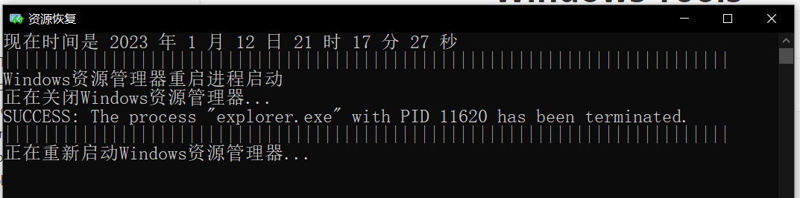
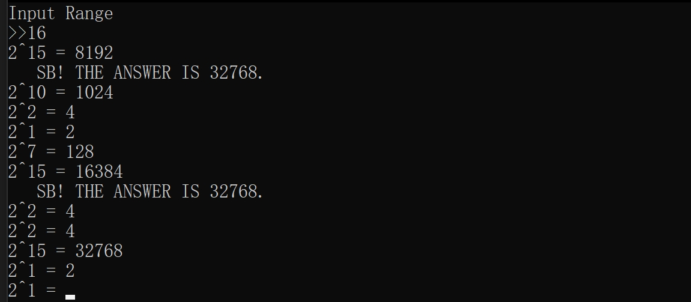

# Windows Tools

## Explorer_Restarter

**Release Time: `2020.1.25`**

```c
#include<stdio.h>
#include<stdlib.h>
#include<time.h>
#include<Windows.h> 

// Encoding: GB2312

int main(){
	
	int sec_now = 0;
 
    time_t timer;
    struct tm *tblock;
    time(&timer);
    tblock = gmtime(&timer);
    
    printf("现在时间是 %d 年 %d 月 %d 日 %d 时 %d 分 %d 秒\n",\
            tblock->tm_year+1900, tblock->tm_mon+1, tblock->tm_mday,\
            tblock->tm_hour+8, tblock->tm_min, tblock->tm_sec);
    printf("|||||||||||||||||||||||||||||||||||||||||||||||||||||||||||||||||||||||||||\n");
 	printf("Windows资源管理器重启进程启动\n");
	printf("正在关闭Windows资源管理器...\n");
	system("taskkill /IM explorer.exe /F");
	printf("|||||||||||||||||||||||||||||||||||||||||||||||||||||||||||||||||||||||||||\n");
 	printf("正在重新启动Windows资源管理器...\n");
	system("start explorer.exe");	//不可以只输入explorer，因为cmd启动一个进程后会等待该进程的结束。 
	Sleep(5000); 
	printf("Windows资源管理器重启完成\n");
	Sleep(1000); 
	return 0; 
	
} 
```



## TwoPowerHelper

Help you become familiar with powers of 2

| exp  | pwr   | exp  | pwr    | exp  | pwr    | exp  | pwr    |
| ---- | ----- | ---- | ------ | ---- | ------ | ---- | ------ |
| 2^0  | 1     | 2^1  | 2      | 2^2  | 4      | 2^3  | 8      |
| 2^4  | 16    | 2^5  | 32     | 2^6  | 64     | 2^7  | 128    |
| 2^8  | 256   | 2^9  | 512    | 2^10 | 1024   | 2^11 | 2048   |
| 2^12 | 4096  | 2^13 | 8192   | 2^14 | 16384  | 2^15 | 32768  |
| 2^16 | 65536 | 2^17 | 131072 | 2^18 | 262144 | 2^19 | 524288 |



# THE END
